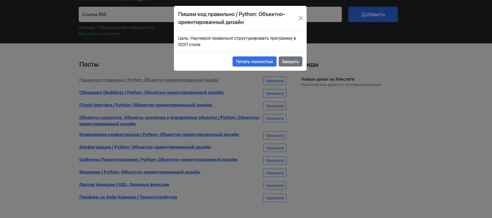

### Hexlet tests and linter status:
[](https://github.com/SageUniverse95/frontend-project-11/actions)
[](https://codeclimate.com/github/SageUniverse95/frontend-project-11/maintainability)

## Description

This is an rss aggregator, it is designed to view rss feeds

## Installation

```
git clone git@github.com:SageUniverse95/frontend-project-11.git
frontend-project-11 %  make install
```
## Usage 

Use your favorite rss feed


And read the latest news




## [Visit to website](https://frontend-project-11-9j92.vercel.app/)